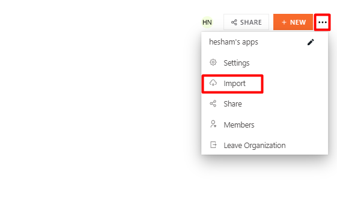
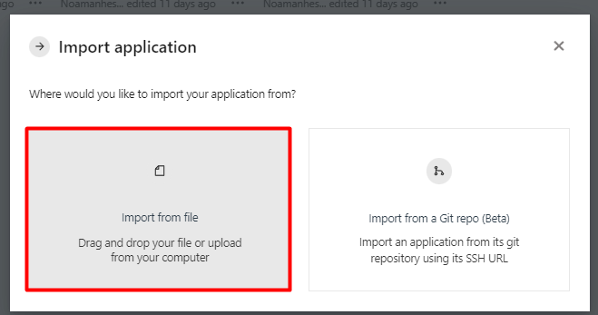
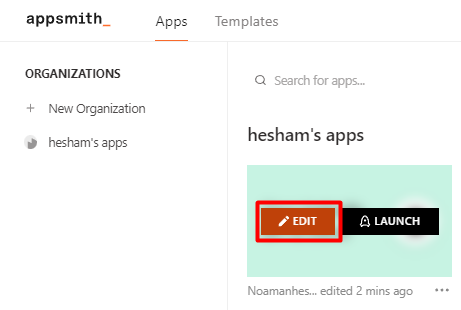
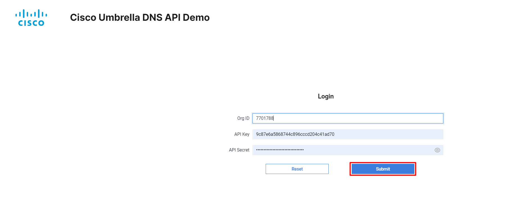
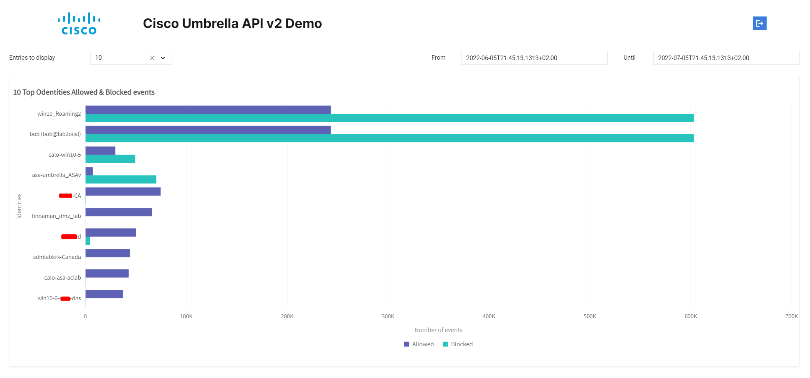
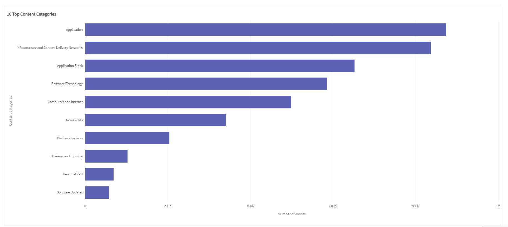
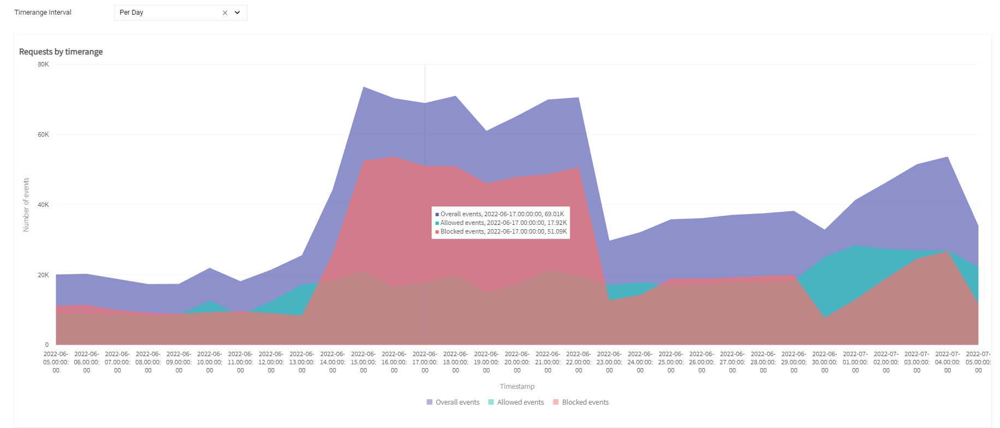
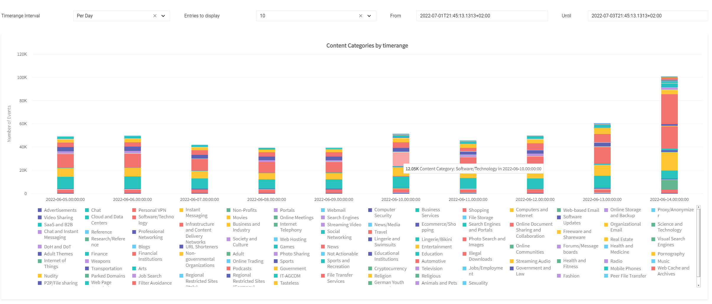
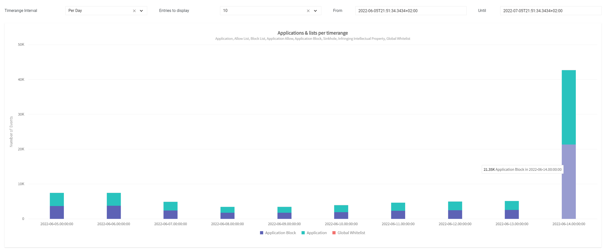
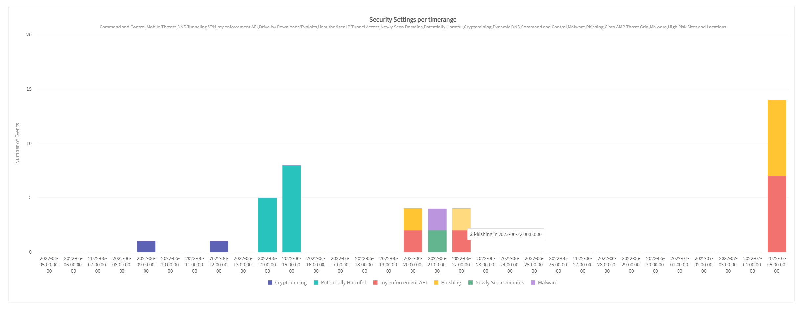

# Cisco-Umbrella-API-v2-Demo-DevNet

This is a basic application that shows multiple DNS graphs based on your Umbrella organization events.  

The scope of this application is show case some of Cisco Umbrella Reporting API v2 related to DNS events only, these graphs are as follow:  

- Top Identities Allowed & Blocked events
- Top Content Categories
- Requests by timerange 
- Content Categories by timerange 
- Applications & lists per timerange
- Security Settings per timerange

## Contacts

* Hesham Noaman (noamanhesham2@gmail.com)

## Installation/Modification:
  

  
The application is hosted on appsmith platform.  
[appsmith](https://www.appsmith.com/) is an Open-source, low-code platform to Build, ship, and maintain CRUD apps  

A demo version of the application can be accessed by clicking on VIEW APPLICATION below  
  
  \
 

If you would like to modify the application and add further graphs consider registering in [appsmith](https://app.appsmith.com/user/login) platform and import Cisco Umbrella API v2 Demo.json as an application  
  

    
  
    

Once imported, you can start modifying the application and adding your own graphs and deploying it to start using the application.   
  

## Usage

The online application that is ready to be used, can be accessed by [clicking here](https://app.appsmith.com/applications/62b5f41920ae3225cef1ca55/pages/62b6a0cb20ae3225cef1f091?embed=true)  
  

The landing page is the login page, where you need to provide your Umbrella ORG ID, Reporting Key, and Reporting API Secret.  

Upon providing them click submit  

  

You will be provided by the dashboard that contains the following graphs:  
  

- Top Identities Allowed & Blocked events  

- Top Content Categories  

- Requests by timerange  

- Content Categories by timerange  

- Applications & lists per timerange  

- Security Settings per timerange  

## Disclaimer

Upon providing your Cisco Umbrella reporting key id and secret, please be aware that these credentials are going to some sort of backend hosted in appsmith instances.  

As mentioned in Appsmith's [documentations](https://docs.appsmith.com/security)  

<pre>
 The Appsmith's backend system doesn't store any information related to the inputs
 made by users using an app or the responses of the queries. It acts as a pure 
 proxy system. It ensures that any private/confidential data is never logged or stored 
 in Appsmith's data stores. Appsmith stores the configuration of the queries so that 
 the SQL query body or custom API URLs are never exposed to the client in "view" 
 mode. Thus protecting the application as viewers cannot deduce the executed query.
</pre>

If you are still concerned about the confidentiality of your credentials consider creating a hosted on-prem containerized instance of Appsmith and import your applications there.  

Further resources on how to create containerized version of appsmith can be found [here](https://docs.appsmith.com/setup/docker)  

## Links to DevNet Learning Labs

For more resources on Umbrella API's  you may refer to the following learning labs:
* [Umbrella Reporting API](https://developer.cisco.com/learning/labs/sase-4-umbrella-reporting-v2/umbrella-reporting-v2-api-overview/)

## License

This source code is provided under Cisco Sample Code License, Version 1.1 License, for details see [Cisco Sample Code License, Version 1.1](./LICENSE.md)
